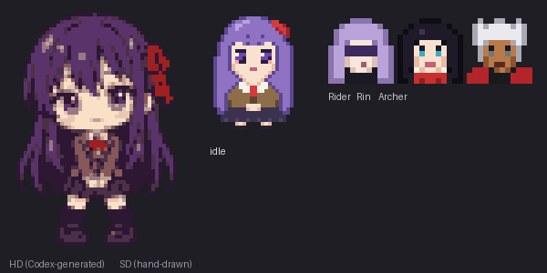

# Heaven's Feel

A [Claude Code mod](https://code.claude.com/docs/en/plugins/mods/overview) that gives every agent a character from *Fate/stay night: Heaven's Feel*.



- **Sakura's room.** A pane where an animated pixel Sakura shows what the session is doing: thinking, reading, editing, running commands, summoning, resting. Past 75% context she turns into Dark Sakura.
- **Servants for subagents.** Each subagent is summoned as a Servant who suits the job. Explore is Rider, Plan is Caster, general-purpose is Saber, reviewers are Archer, debuggers are True Assassin. Their cards appear in Sakura's room, and pressing one opens that Servant's own transcript.
- **A face on every message.** Main-session replies wear a Master's face (Sakura, Shirou, Rin, Illya or Kirei, chosen per message). A subagent's replies wear its Servant's face.
- **A band above the prompt** with Sakura's portrait, what she is doing, and a figure for each working Servant.
- **The spinner** gets an in-character verb.

It draws pixel art on the terminal and animated SVG in the Claude desktop app, matching the app's light or dark theme.

## Install

```bash
claude plugin marketplace add yedidyakfir/heavens-feel
```

```bash
claude plugin install heavens-feel@heavens-feel
```

You need a Claude Code version with mods (function hooks).

## Use

`/hf` opens Sakura's room. It also takes these arguments: `on`, `off`, `cast` (the full roster), `dark`, `say`, `sleep`, `bond`.

Settings, under the plugin's options:

| Option | Default | What it does |
| :- | :- | :- |
| Open pane on start | on | Opens Sakura's room when a session starts (wide terminals only) |
| Band above prompt | auto | `auto`, `always` or `never` |
| Spinner takeover | word | `off` or `word` |
| Dark Sakura threshold | 75 | Context percent where Sakura turns dark |
| Sleep after (minutes) | 5 | Idle time before she falls asleep |
| Timezone | Asia/Jerusalem | For her greetings, which keep Shabbat |

## What it can reach

A mod runs inside Claude Code with your permissions. This one reads session events, transcripts and subagent messages to draw them, keeps a few values in its plugin store (a bond counter, whether the pane was open, a Dark Sakura override), and makes no network requests. Run `claude plugin validate` on the folder to see every hook and call it makes.

## Develop

```bash
CLAUDE_CODE_ENABLE_FUNCTION_HOOKS=1 claude plugin test .
```

The Sakura portraits were drawn as pixel art and refined with image generation; `tools/` holds the Python pipeline that turns the PNGs in `art/` into `hooks/sprites.generated.ts`. `DESIGN.md` is the original design.

## Credits

A fan work. *Fate/stay night* and its characters belong to TYPE-MOON; this project is not affiliated with or endorsed by them. Code under the MIT license.
